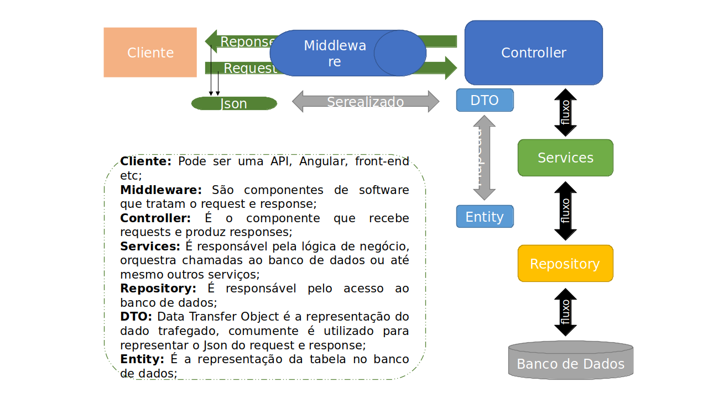

# Criando um catálogo de jogos usando boas práticas de arquitetura com .NET

## Objetivo ☑️

Criar uma arquitetura base para uma aplicação .NET do zero. Essa aplicação é uma API de um catálogo de jogos.

Neste projeto foram vistos alguns conceitos como: requisições web, arquitetura model-view-controller, web api e threading. Além desses conceitos mais teóricos, também foi explicitado como realizar essas implementações utilizando o .NET Core. O projeto foi elaborado pelo expert [Thiago Campos de Oliveira](https://www.linkedin.com/in/thiago-campos-de-oliveira-693a3840/), sendo disponibilizado na plataforma da Digital Innovation One, sob o nome de Criando um catálogo de jogos usando boas práticas de arquitetura com .NET.

## Arquitetura 🔄

## Implementações extras ⬆️

Algumas melhorias e refatorações podem ocorrer nesse projeto:
